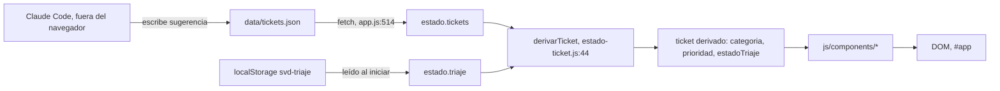
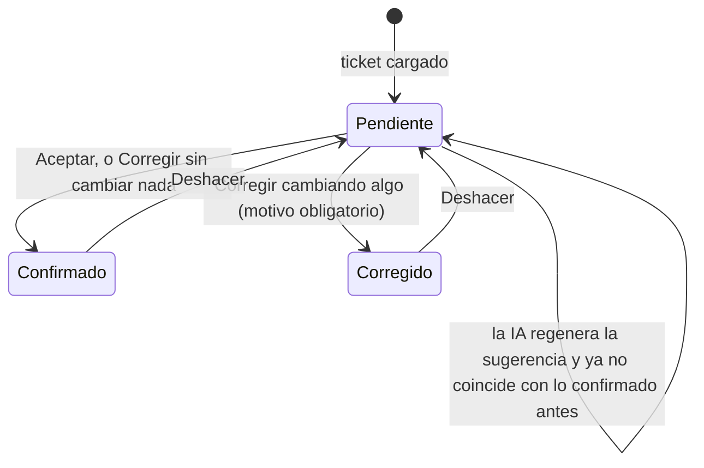

# Análisis técnico completo — Mini Service Desk

Hecho con la skill `auditoria-tecnica-completa` el 24/09/2026. Objetivo: que alguien que nunca ha
visto este repo pueda leer este único documento y salir sabiendo cómo funciona, dónde tocar para
cambiar algo concreto, y qué riesgos hay. No reescribe nada; no publica nada.

> ⚠️ Este análisis lo ha hecho la misma sesión que escribió el código documentado (hoy: R9, el
> rediseño de la vista C, R10, las capturas de referencia). Es una limitación real: pídele a
> alguien (persona u otra sesión de Claude Code) que lo repase antes de usarlo como referencia de
> onboarding.

Cada afirmación viene de leer el código real o de ejecutar algo (`grep`, `wc -l`, `npm test`,
medición en un navegador) — se marca **(comprobado)** cuando es así. Donde no se pudo verificar
del todo, se marca **(interpretado)**.

---

## 1. Resumen ejecutivo del sistema

Mini Service Desk es una bandeja de incidencias de seguridad física (alarmas, control de accesos,
CCTV…) para un servicio ficticio. Una IA — en la práctica, Claude Code trabajando sobre este mismo
repositorio, nunca el navegador — sugiere cómo clasificar cada ticket (categoría, urgencia,
impacto), y un operador humano la confirma o la corrige desde una página web. La prioridad no la
decide nadie: la calcula una fórmula fija a partir de la urgencia y el impacto ya confirmados.

Es una aplicación **estática**: HTML, CSS y JavaScript planos, sin backend, sin build y sin ninguna
dependencia en tiempo de ejecución **(comprobado**, `package.json`: `"dependencies"` no existe,
solo `"devDependencies": { "@playwright/test" }`, y ese paquete es solo para pruebas). El dato
persiste en el navegador de cada operador (`localStorage`) y se exporta manualmente como un JSON
que alguien sube de vuelta al repositorio.

## 2. Stack tecnológico

**(comprobado)**, leyendo `package.json`, `playwright.config.js`, `index.html` y el código real
antes de nombrar nada:

| Pieza | Qué es | Dónde consta |
|---|---|---|
| HTML5 + CSS3 planos | Sin preprocesador, sin framework de estilos | `index.html`, `css/styles.css` (889 líneas) |
| JavaScript ES2022+ (módulos nativos) | `<script type="module">`, sin transpilar, sin bundler | `index.html:11`, todo `js/` usa `import`/`export` |
| `fetch` con `{ cache: "no-store" }` | Único mecanismo de red de la app | `js/app.js:514` |
| `localStorage` | Única persistencia | `js/app.js:31,42,50` |
| Hash routing manual (`location.hash`) | Sin librería de rutas | `js/app.js:198-210` |
| Playwright Test 1.63.0 | Única dependencia real, solo de desarrollo | `package.json` |
| `python -m http.server` | Servidor de desarrollo, no forma parte de la app | `CLAUDE.md`, `tests/soporte/servidor.py` |

No hay React, Vue, ni ningún framework de UI: cada "componente" es una función JavaScript que
construye nodos del DOM a mano con `document.createElement`. No hay TypeScript: el proyecto es
JavaScript sin tipos, con la disciplina de nombres y comentarios como única documentación de
forma. No hay ningún sistema de build (Webpack, Vite, esbuild…): los archivos se sirven tal cual.

## 3. Arquitectura general

La frontera que define el proyecto — y que aplica constitución arriba — es: **la clasificación la
hace una IA sobre el repositorio (fuera de este código), el navegador solo muestra y registra
decisiones humanas.**

```
Claude Code (fuera de este repo en ejecución)
     │ escribe "sugerencia": {categoria, urgencia, impacto, motivo}
     ▼
data/tickets.json  ──fetch (js/app.js:514)──►  Navegador
                                                   │
                                    ┌──────────────┴──────────────┐
                                    │  js/app.js (estado, IO, DOM) │
                                    └──────────────┬──────────────┘
                                                    │
                            ┌───────────┬───────────┼───────────┬────────────┐
                            ▼           ▼           ▼           ▼            ▼
                     js/utils/*   js/components/*  localStorage  render()  eventos DOM
                    (funciones      (fábricas de     (svd-triaje,  (repinta   (clic, teclado,
                     puras)          nodos DOM)       svd-tema)    #app)      hashchange)
```

Es una arquitectura de **"núcleo funcional, cáscara imperativa"** (*functional core, imperative
shell*, patrón habitual en apps sin framework): `js/utils/` son funciones puras, sin estado y sin
tocar el DOM — comprobado en la sección 11 (SRP) y por el propio test estático
`tests/unit/constitucion.spec.js` que impide que toquen `document`/`window`/`localStorage`. Toda
la parte impura (red, almacenamiento, DOM, eventos) vive en un único archivo, `js/app.js`.

No hay capas de "servicio", "repositorio" ni "controlador" con nombre propio: `js/app.js` hace de
las tres a la vez. Es una decisión razonable para 538 líneas y sin backend (ver sección 17, puntos
críticos, y sección 18, deuda técnica, para el coste de esto).

## 4. Estructura del repositorio

**(comprobado)**, `ls` de la raíz y tamaño con `du -sh`:

```
index.html                 punto de entrada (13 líneas)
css/styles.css              todos los estilos (889 líneas), sin lógica
js/
  app.js                    único orquestador; único que hace fetch (538 líneas)
  utils/                    7 archivos, funciones puras (353 líneas en total)
  components/               8 archivos, fábricas de nodos DOM (897 líneas en total)
data/tickets.json           dataset: 60 tickets + los creados a mano en localStorage al exportar
tests/                      23 archivos .spec.js (unit/ y e2e/) + soporte/
docs/                       476 KB: constitución, spec, diseño, QA, wireframes, esta auditoría
.claude/                    85 KB: instrucciones y skills de Claude Code (incluida esta)
assets/referencias/         1,7 MB: capturas de diseño de la Fase 2
deep-research/               76 KB: investigación previa al spec
package.json, playwright.config.js, .github/   solo para probar y para el CI
```

`js/utils/` y `js/components/` son los únicos "módulos compartidos": no hay ningún otro paquete ni
librería interna. No hay infraestructura relacionada (sin servidor propio, sin base de datos, sin
contenedor): el único servicio externo que la app "usa" en producción es el propio hosting
estático que la sirva.

## 5. Puntos de entrada del sistema

**(comprobado)**:

- **`index.html`** es el único punto de entrada HTTP. Carga `css/styles.css` (línea 7) y
  `js/app.js` como módulo (línea 11); no hay ningún otro `<script>`.
- **`js/app.js:538`**, la última línea del archivo: `iniciar();` — se ejecuta en cuanto el módulo
  se carga, sin esperar a ningún evento. Es la única función que arranca la app.
- No hay ningún otro punto de entrada: ni CLI, ni endpoint de servidor, ni webhook. La suite de
  pruebas (`tests/`) tiene su propio punto de entrada (`playwright.config.js`), pero es
  herramienta de desarrollo, no parte de la app en producción.

## 6. Mapa completo del front-end

**(comprobado)**, por los `import` reales de cada archivo, no por el nombre de la carpeta:

| Archivo | Qué exporta | Quién lo importa |
|---|---|---|
| `js/components/fila-ticket.js` | `crearFilaTicket` | `js/app.js:7` |
| `js/components/barra-filtros.js` | `crearBarraFiltros` | `js/app.js:8` |
| `js/components/ficha-ticket.js` | `crearFichaVer`, `crearFichaCorregir` | `js/app.js:9` |
| `js/components/panel-metricas.js` | `crearPanelMetricas` | `js/app.js:10` |
| `js/components/nuevo-ticket.js` | `crearFormularioNuevoTicket` | `js/app.js:11` |
| `js/components/campo-texto.js` | `crearCampoTexto` | `ficha-ticket.js:9`, `nuevo-ticket.js:4` |
| `js/utils/constantes.js` | enums y claves de dominio | `app.js`, `estado-ticket.js`, `prioridad.js`, `filtros.js`, `ficha-ticket.js`, `campo-texto.js`, `nuevo-ticket.js`, `clasificador-nuevo-ticket.js` |
| `js/utils/estado-ticket.js` | `derivarTicket`, `snapshotDeSugerencia`, `estadoAlGuardar` | `app.js:5`, `ficha-ticket.js:7` |
| `js/utils/prioridad.js` | `calcularPrioridad`, `urgenciasPermitidas`, `esSugerenciaCoherente` | `estado-ticket.js:5`, `app.js` (indirecto), `ficha-ticket.js:6` |
| `js/utils/filtros.js` | `ordenarBandeja`, `filtrarTickets`, `valoresUnicos`, `calcularMetricas` | `app.js:6` |
| `js/utils/formato.js` | `formatearFecha`, `fechaLocal`, `formatearFechaHora` | `app.js:12`, `ficha-ticket.js:8` |
| `js/utils/texto-operador.js` | `pareceDatoPersonal`, `validarTextoOperador`, `unirNotas` | `app.js:13`, `campo-texto.js:5` |
| `js/utils/clasificador-nuevo-ticket.js` | `clasificarTicketNuevo` | `app.js:14` |

`js/app.js` es el único archivo que importa componentes (`js/components/`) **y** utilidades
(`js/utils/`) a la vez: es el punto donde ambos mundos se encuentran. Ningún componente importa
otro componente salvo `campo-texto.js`, que reutilizan `ficha-ticket.js` y `nuevo-ticket.js` (ver
sección 12, patrón de composición).

## 7. Mapa de transiciones entre vistas

**(comprobado)**, `js/app.js:198-210` (`rutaActual`) y `:489-505` (`render`):

```
location.hash                         render() construye
─────────────────────                 ──────────────────────────────────────────
""  |  "#/bandeja"                 →  Rail + Bandeja (lista) + Ficha vacía
"#/ticket/SVD-4102"                →  Rail + Bandeja (lista) + Ficha en modo "ver"
"#/ticket/SVD-4102/corregir"       →  Rail + Bandeja (lista) + Ficha en modo "corregir"
"#/metricas"                       →  Rail + Panel de métricas (pantalla completa)
```

**Dato importante para quien venga de una SPA con router "de verdad":** no hay ninguna librería de
rutas. `rutaActual()` (`app.js:198`) analiza `location.hash` a mano con una expresión regular y un
`split("/")`. Cada `hashchange` del navegador dispara `render()` (`app.js:527`), que **repinta
toda la pantalla desde cero** (`raiz.replaceChildren()`, `app.js:492`) — no hay reconciliación de
DOM virtual ni actualización parcial, salvo el cuidado explícito de conservar el `scrollTop` de la
lista y el foco (`app.js:491,498-504`, comentado como arreglo de un bug real del rediseño).

La Bandeja y la Ficha **no son dos pantallas distintas** desde el rediseño del 24/09/2026: viven en
el mismo `<main>` (`crearVistaBandeja`, `app.js:268-398`), lado a lado. "Volver a la bandeja" solo
cambia el hash a `#/bandeja`, no navega a otro documento.

## 8. Flujo completo de guardado/persistencia de datos

**(comprobado)**, siguiendo cada escritura real a `localStorage`:

```
localStorage["svd-triaje"]  (una sola clave JSON, app.js:35 CLAVE_TRIAJE)
{
  [id]: { estado, categoria, urgencia, impacto, motivoCorreccion,
          sugerenciaSnapshot, fecha }        ← una confirmación por ticket (app.js:94-108)
  _notas: { [id]: [{texto, fecha}] }         ← notas del operador (app.js:112-118)
  _nuevos: [ {id, titulo, ...} ]             ← tickets creados a mano (app.js:120-138)
  _meta: { ultimaModificacion, ultimoExport,
           sembrados, siguienteIdNuevo }     ← metadatos, no por ticket (app.js:76-78,124,191)
}

localStorage["svd-tema"]  (app.js:36 CLAVE_TEMA)
"claro" | "oscuro"
```

Cada escritura pasa por `escribir()` (`app.js:48-54`), que envuelve `localStorage.setItem` en un
`try/catch`: si falla (modo incógnito estricto, cuota llena), la app sigue funcionando en memoria
y marca `estado.localStorageDisponible = false` (visible en el rail, `app.js:258-263`).

**Por qué `_notas`, `_nuevos` y `_meta` están separados de la entrada por ticket, y no dentro de
ella** (comprobado por el comentario y confirmado leyendo `deshacerConfirmacion`, `app.js:140-144`,
que solo hace `delete estado.triaje[id]`): "Deshacer" borra exactamente la entrada de ese id. Si
las notas vivieran dentro de esa misma entrada, deshacer una corrección se llevaría también las
notas — el spec (R9) exige que no.

**Sincronización con el archivo:** al arrancar (`sembrarTriajeDesdeJSON`, `app.js:452-474`), si
`data/tickets.json` ya trae un campo `triaje` (porque alguien subió de vuelta un export), ese
valor manda sobre lo que hubiera en `localStorage`, pero solo la primera vez que se ve esa versión
exacta (comparada por huella JSON, `app.js:465-468`) — así el operador puede seguir corrigiendo
después sin que la siguiente carga le pise el trabajo.

## 9. Trazabilidad de flujos (contra el spec y las etiquetas de los tests)

**(comprobado)**, contando archivos de test por etiqueta con `grep -rl`:

| Requisito | Qué exige (resumen) | Nº de archivos de test que lo etiquetan |
|---|---|---|
| R1 | Forma de `sugerencia` en el dataset | 2 |
| R2 | Urgencia/impacto por hechos observables | 1 |
| R3 | Matriz de prioridad | 1 |
| R4 | Bandeja: orden, filtros, destacado | 6 |
| R5 | Aceptar/Corregir/Deshacer | 4 |
| R6 | `localStorage`, export, sincronización | 7 |
| R7 | Métricas y tasa de corrección | 6 |
| R8 | Coherencia categoría×urgencia×zona | 5 |
| R9 | Notas y motivo de corrección | 4 |
| R10 | Crear ticket, clasificador de reglas | 2 |

Cero requisitos (R1–R10, P1–P6) sin al menos un archivo de test que lo mencione — comprobado
recorriendo `docs/pruebas/matriz-trazabilidad.md`, que mantiene esta relación fila a fila, y
confirmado en bruto con el conteo de arriba. La matriz de trazabilidad detallada, con el archivo y
el nombre del test exacto por requisito, ya existe y no se duplica aquí: ver sección 26 para el
resumen final requisito → código → test.

## 10. Dependencias entre componentes

**(comprobado)**, grafo de `import` real:

```
app.js
 ├─► utils/constantes.js        (sin dependencias propias)
 ├─► utils/estado-ticket.js ──► utils/constantes.js, utils/prioridad.js
 ├─► utils/prioridad.js     ──► utils/constantes.js
 ├─► utils/filtros.js       ──► utils/constantes.js
 ├─► utils/formato.js           (sin dependencias propias)
 ├─► utils/texto-operador.js    (sin dependencias propias)
 ├─► utils/clasificador-nuevo-ticket.js ──► utils/constantes.js
 ├─► components/fila-ticket.js      (sin dependencias propias)
 ├─► components/barra-filtros.js    (sin dependencias propias)
 ├─► components/ficha-ticket.js ──► utils/constantes.js, utils/prioridad.js,
 │                                  utils/estado-ticket.js, utils/formato.js,
 │                                  components/campo-texto.js
 ├─► components/panel-metricas.js   (sin dependencias propias)
 └─► components/nuevo-ticket.js ──► utils/constantes.js, components/campo-texto.js
      components/campo-texto.js ──► utils/constantes.js, utils/texto-operador.js
```

No hay ninguna dependencia circular (comprobado por inspección del grafo: es un árbol, salvo que
`ficha-ticket.js` y `nuevo-ticket.js` comparten `campo-texto.js`, lo cual no es un ciclo). Ningún
componente de `js/components/` importa a otro componente salvo por `campo-texto.js`, que es
explícitamente un componente reutilizable compartido. Ninguna utilidad de `js/utils/` importa
nunca un componente: el flujo de dependencia va siempre de "impuro" (`app.js`, `components/`)
hacia "puro" (`utils/`), nunca al revés — es justo lo que hace verificable el patrón de la sección
3.

## 11. Principios SOLID: aplicados o incumplidos

Explicación breve para quien no los tenga frescos: los **principios SOLID** son cinco reglas de
diseño orientado a objetos para que el código sea fácil de extender sin romperlo. Aunque este
proyecto no usa clases (comprobado: `grep -rn "class " js/` no encuentra ninguna), los principios
siguen siendo útiles para juzgar funciones y módulos.

**S — Responsabilidad única (Single Responsibility)**

- ✅ *Aplicado* en `js/utils/prioridad.js` (43 líneas): solo calcula la matriz de prioridad y valida
  coherencia. `js/utils/estado-ticket.js` (72 líneas): solo combina el ticket original con lo
  guardado. `js/utils/filtros.js` (83 líneas): solo ordena/filtra/agrega. Cada uno se podría
  explicar en una frase sin usar "y".
- ⚠️ *Incumplido* en `js/app.js` (538 líneas): un único archivo hace de **estado global**
  (`app.js:18-26`), **capa de persistencia** (`app.js:28-66`), **enrutador**
  (`app.js:198-210,489-505`), **motor de renderizado** de las cuatro pantallas
  (`app.js:214-445`) y **arranque de la app** (`app.js:507-538`). Es un "módulo dios" — funciona
  y está bien comentado, pero cualquier cambio (una vista nueva, un campo nuevo de estado) casi
  siempre toca este mismo archivo. Ver sección 18 (deuda técnica) para el impacto real.

**O — Abierto/cerrado (Open/Closed)**

Un módulo está "abierto a extensión, cerrado a modificación" si se le puede añadir comportamiento
sin tocar el código que ya funciona — normalmente, añadiendo datos a una tabla en vez de código a
una función.

- ✅ *Aplicado* en `js/utils/clasificador-nuevo-ticket.js:8-16` (`REGLAS`): añadir una categoría
  nueva al clasificador de R10 es añadir un objeto al array `REGLAS`, sin tocar la función
  `clasificarTicketNuevo` (`:28-48`) que las recorre. Igual en `js/utils/prioridad.js:6-10`
  (`MATRIZ`): la tabla de prioridad es datos, no código.
- ⚠️ *Parcial* en `js/components/barra-filtros.js:31-82`: los cinco filtros de la bandeja están
  escritos en línea, uno a uno, dentro de `crearBarraFiltros`. Añadir un sexto filtro exige editar
  esta función directamente (no hay una lista de configuración de filtros que recorrer), aunque el
  coste de hacerlo es bajo porque el patrón ya es muy repetitivo y fácil de copiar.

**L — Sustitución de Liskov (Liskov Substitution)**

No aplica de forma directa: Liskov habla de que una subclase se pueda usar donde se espera la
clase base, y este proyecto **no tiene ninguna clase ni jerarquía de herencia** (comprobado,
`grep -rn "class \|extends " js/`: cero resultados). Es una decisión coherente con el principio 6
de la constitución (sin frameworks) y con el tamaño del proyecto: introducir clases y herencia
aquí sería una abstracción sin ningún caso de uso que la necesite.

**I — Segregación de interfaces (Interface Segregation)**

- ⚠️ *Incumplido, leve* en `js/app.js:411-432` (el objeto `callbacks`): se construye un único
  objeto con siete funciones (`onVolver`, `onAceptar`, `onCorregir`, `onDeshacer`, `onGuardar`,
  `onAnadirNota`, `onCancelar`) y se pasa entero a `crearFichaVer`/`crearFichaCorregir`
  (`ficha-ticket.js:230,279`), que a su vez lo reparte entero a `crearCabecera` (que solo usa
  `onVolver`, `:23`), `crearAcciones` (que solo usa tres de los siete, `:131`) y
  `crearPanelNotas` (que solo usa `onAnadirNota`, `:173`). Cada función recibe más de lo que
  necesita. Funciona porque JavaScript no obliga a declarar la forma exacta de un objeto, pero
  dificulta saber, mirando la firma de `crearAcciones`, qué necesita de verdad sin leer su cuerpo.

**D — Inversión de dependencias (Dependency Inversion)**

No aplica en el sentido clásico (módulos de alto nivel dependiendo de abstracciones, no de
implementaciones concretas): `js/app.js:4-14` importa directamente cada componente y utilidad
concretos, sin ninguna capa de interfaz o inyección de dependencias en medio. **Esto es una
decisión razonable, no un defecto**: para una app de este tamaño, sin backend y sin necesidad real
de intercambiar implementaciones, añadir una capa de abstracción sería complejidad sin beneficio
(la propia constitución, principio 6, pide lo contrario: "sin frameworks, sin dependencias
externas").

## 12. Patrones de diseño y programación usados

Explicación breve: un **patrón de diseño** es una solución con nombre a un problema que se repite;
reconocerlos ayuda a predecir cómo se comporta el código sin leerlo entero.

- **Fábrica (Factory Function).** Cada función `crear*` de `js/components/` (`crearFilaTicket`,
  `crearFichaVer`, `crearBarraFiltros`, `crearPanelMetricas`, `crearCampoTexto`,
  `crearFormularioNuevoTicket`…) recibe datos y devuelve un nodo del DOM ya construido, sin usar
  `new` ni clases. Es el mismo patrón repetido de forma consistente en los 8 archivos de
  `js/components/`.
- **Núcleo funcional / cáscara imperativa** (ver sección 3). `js/utils/` son funciones puras;
  `js/app.js` es la única cáscara con efectos secundarios (red, `localStorage`, DOM).
- **Selector / estado derivado.** `derivarTicket` (`js/utils/estado-ticket.js:44-65`) combina dos
  fuentes de verdad (el ticket original y lo confirmado en `localStorage`) en un objeto "de
  vista" que se recalcula en cada `render()`, sin guardarse nunca. Es el mismo patrón que un
  *selector* en librerías de estado tipo Redux: la fuente de verdad son los dos datos originales,
  no el resultado combinado.
- **Estrategia guiada por datos (Strategy, sin clases).** `REGLAS` en
  `js/utils/clasificador-nuevo-ticket.js:8-16`: un array de reglas con la misma forma, recorrido
  hasta encontrar la primera que encaja (`:30`). Añadir una estrategia nueva es añadir una fila,
  no una rama `if`.
- **Publicador/suscriptor nativo (event-driven).** El enrutado (`app.js:527`,
  `window.addEventListener("hashchange", render)`) usa el propio sistema de eventos del navegador
  como bus de eventos, en vez de un `EventEmitter` propio.
- **Módulo (Module Pattern) vía ES Modules.** Cada archivo declara ayudantes privados sin
  `export` (por ejemplo, `fila()` en `ficha-ticket.js:11`, usado solo dentro del propio archivo)
  y expone una API pública pequeña con `export`. Es el mecanismo nativo de encapsulación de
  JavaScript moderno, sin necesidad de IIFEs ni de convención de guion bajo.
- **Objeto de opciones con valores por defecto.** Casi cualquier función de `js/components/`
  recibe un único objeto de parámetros con desestructuración y valores por defecto (ejemplo:
  `crearFilaTicket(ticket, { onAbrir, seleccionado = false, tabulable = true } = {})`,
  `fila-ticket.js:13`), en vez de una lista larga de argumentos posicionales.

## 13. Otras prácticas de ingeniería

**(comprobado)**:

- **Comentarios como documentación de decisión, no de descripción.** La inmensa mayoría de los
  comentarios del repo no dicen "qué hace" la línea siguiente (eso ya se ve leyendo el código),
  sino "por qué" se hizo así y a qué requisito responde — por ejemplo, `app.js:72-75` explica por
  qué `_meta` está separado de las entradas por ticket, citando el caso límite exacto del spec.
- **Etiquetado sistemático de pruebas por requisito** (`@R1`…`@R10`, `@P1`…`@P6`), que permite
  ejecutar solo lo que toca un cambio (`npx playwright test --grep "@R6"`) y construir la matriz de
  trazabilidad de la sección 9 con un `grep`, no a mano.
- **Puerta de calidad automática antes de cada commit**: un hook de Claude Code
  (`.claude/hooks/pruebas-antes-de-commit.mjs`) ejecuta `npm test` completo antes de cualquier
  `git commit` lanzado por Claude Code, y lo bloquea si falla — comprobado leyendo el script y por
  el historial de commits de hoy, donde cada uno pasó por él.
- **Mutación manual como prueba de que la suite prueba de verdad**: en vez de una herramienta de
  mutation testing (que sería una dependencia nueva, contra el principio 6), el equipo ha sembrado
  bugs a mano en el código, comprobado que la suite los detecta, y restaurado el archivo — once
  veces documentadas en `docs/pruebas/informe-de-pruebas.md`.
- **Sin gestor de estado externo.** El "estado global" es un objeto plano (`app.js:18-26`), mutado
  directamente y sin ninguna librería (no hay Redux, Zustand, ni similar) — coherente con el
  principio 6 y razonable a esta escala.

## 14. Explicación pedagógica del código

Para alguien que nunca ha visto este repo, el recorrido más corto para entenderlo es seguir un
clic real:

1. **La página carga.** `index.html` pide `css/styles.css` y `js/app.js`. Lo último que hace
   `app.js` es llamar a `iniciar()` (`app.js:538`).
2. **`iniciar()` (`app.js:507-536`)** hace tres cosas en orden: comprueba si `localStorage`
   funciona, carga lo que hubiera guardado, y pide `data/tickets.json` por red. Si algo de esto
   falla, muestra un mensaje de error y para ahí (`app.js:517-520`) — la app nunca se queda a
   medio cargar sin avisar.
3. **`render()` (`app.js:489-505`)** mira la dirección actual del navegador (`location.hash`) y
   decide qué pintar. Como es una app de una sola página, "pintar" significa borrar todo
   `#app` (`raiz.replaceChildren()`) y volver a construirlo desde cero con `document.createElement`
   — no hay plantillas HTML ni un motor de vistas.
4. **Un ticket nunca se pinta "en crudo".** Antes de llegar a cualquier función de
   `js/components/`, pasa por `derivarTicket()` (`js/utils/estado-ticket.js:44`), que decide si su
   sugerencia es válida, si lo que hay guardado en `localStorage` sigue siendo válido, y calcula su
   prioridad. Esta es la función más importante para entender el "porqué" de casi cualquier
   comportamiento raro que se vea en pantalla.
5. **Un clic no navega a otra página.** Al pulsar una fila (`fila-ticket.js:78`,
   `onAbrir?.(ticket.id)`), lo único que pasa es `location.hash = "#/ticket/SVD-XXXX"`
   (`app.js:347`). El navegador dispara un evento `hashchange`, que `app.js:527` escucha y que
   vuelve a llamar a `render()`. Todo el "enrutado" de esta app es, en el fondo, ese único listener.
6. **Guardar algo (Aceptar, Corregir, una nota, un ticket nuevo) siempre pasa por tres pasos**:
   cambiar el objeto `estado.triaje` en memoria, llamar a `guardarTriaje()` para persistirlo en
   `localStorage`, y volver a llamar a `render()` (o navegar, que dispara `render()` solo). No hay
   ningún otro sitio donde se escriba en `localStorage`.

## 15. Manejo de errores

**(comprobado)**, cada punto donde el código puede fallar y qué hace la app:

| Dónde puede fallar | Qué hace la app | Cita |
|---|---|---|
| `localStorage` no disponible (incógnito estricto, cuota llena) | Sigue en memoria; avisa en el rail | `app.js:28-37,258-263` |
| `JSON.parse` de lo guardado sale corrupto | Empieza de cero en vez de romper la bandeja | `app.js:56-62` (`catch { return {}; }`) |
| `fetch("data/tickets.json")` falla o responde con un HTTP de error | Mensaje de error en pantalla, la app no continúa | `app.js:513-520` |
| Un ticket no existe (id en la URL que no está en el dataset) | Mensaje "No existe ningún ticket con id…", sin romper el resto de la pantalla | `app.js:403-408` |
| El operador escribe algo con forma de DNI/NIE/matrícula en una nota | Se bloquea el guardado con un mensaje explicando por qué | `js/utils/texto-operador.js:18-27` |
| La sugerencia de la IA es incoherente (categoría/urgencia/impacto imposibles) | Se trata como "Sin clasificar", nunca se muestra como si fuera válida | `js/utils/estado-ticket.js:17-33` |
| Exportar en Firefox | El enlace de descarga se añade al documento y se revoca en el siguiente tick, no en el mismo — comentado explícitamente como arreglo de un bug de Firefox | `app.js:184-189` |

No hay ningún bloque `try/catch` alrededor del propio `render()` ni de los manejadores de eventos
de clic — **(interpretado)**: un error inesperado dentro de la construcción de una vista (por
ejemplo, un `TypeError` si un dato llega con una forma distinta a la esperada) no tiene una
pantalla de error genérica ni se registra en ningún sitio; se propagaría como un error no
capturado en la consola del navegador y la interfaz podría quedar a medio pintar. No se ha
comprobado un caso real que lo dispare (la suite no reproduce datos malformados hasta ese punto),
así que se deja como observación, no como hallazgo confirmado.

## 16. Seguridad

**(comprobado)**:

- **Inyección de HTML / XSS**: `grep -rn "innerHTML\|outerHTML\|insertAdjacentHTML\|document\.write\|eval(\|new Function("
  js/ index.html` no encuentra ninguna coincidencia en todo el proyecto. Todo el texto dinámico —
  títulos, descripciones, motivos de la IA, notas del operador, motivos de corrección — se asigna
  siempre a `.textContent`, nunca a `.innerHTML` (comprobado leyendo cada componente; ejemplo,
  `fila-ticket.js:31,37`, `ficha-ticket.js:39,202`). Esto significa que, aunque alguien escriba
  `` en una nota, se pinta como texto literal, no se ejecuta.
- **Claves, contraseñas o secretos**: búsqueda por patrones (`api[_-]?key`, `secret`, `password`,
  `Bearer `, `AKIA`, `sk-...`, bloques `-----BEGIN...KEY-----`) en todo `.js`/`.json`/`.md`/`.html`,
  excluyendo `node_modules/` y artefactos de test: ningún resultado real. No hay archivos `.env`,
  `.pem` ni `id_rsa*`. Coincide con que la app nunca llama a ningún servicio externo (principio 2
  y 6 de la constitución) y con `tests/e2e/seguridad.spec.js`, que vigila en cada pasada que no
  salga ninguna petición fuera del propio origen.
- **Qué se publicaría sin hacer falta**: idéntico hallazgo que en `docs/auditoria.md` (la
  auditoría de despliegue anterior, ya resuelta con `.surgeignore`): `.claude/`, `docs/`,
  `tests/`, `node_modules/`, `assets/` y `.git/` no hace falta subirlos para que la app funcione —
  solo `index.html`, `css/`, `js/` y `data/tickets.json`. Ver sección 28 para el detalle completo y
  el `.surgeignore` propuesto (ya aplicado como archivo real el 24/09/2026, fuera del alcance de
  esta auditoría de solo-lectura).
- **Datos personales del propio dominio**: la constitución (principio 3) prohíbe datos reales; el
  código lo hace cumplir activamente para el texto que escribe el operador —
  `js/utils/texto-operador.js:6-15` bloquea patrones de DNI, NIE y matrícula española antes de
  guardar cualquier nota, motivo de corrección, título o descripción de un ticket nuevo. Límite
  declarado y comprobado en el propio comentario (`texto-operador.js:5`): no detecta nombres
  propios, solo estos tres patrones con forma fija.

## 17. Puntos críticos del código

Zonas donde un fallo tendría el mayor impacto, o donde el código concentra más decisiones:

1. **`js/utils/estado-ticket.js#derivarTicket` (líneas 44-65)** — es el único lugar donde se
   decide si una sugerencia es válida y si una confirmación guardada sigue vigente. Todo lo demás
   de la app (la fila, la ficha, las métricas, el export) confía en su resultado sin volver a
   comprobar nada. Un error aquí se propaga a toda la pantalla.
2. **`js/utils/prioridad.js#MATRIZ` (líneas 6-10)** — la única fuente de la prioridad. Si un valor
   de la tabla estuviera mal, no habría ningún otro sitio del código que lo detectara (aunque sí lo
   detectaría `tests/unit/prioridad.spec.js`, que prueba las 9 combinaciones).
3. **`js/app.js#iniciar` (líneas 507-536)** — el único punto de carga. Si `fetch` falla, la app
   entera se detiene con un mensaje de texto (`app.js:518`): no hay reintento ni carga parcial.
4. **`js/app.js#render` (líneas 489-505)** — se llama en cada interacción del operador. Repinta
   toda la pantalla; cualquier lentitud aquí se nota en cada clic (ver `tests/e2e/rendimiento.spec.js`
   para los presupuestos de tiempo que ya vigilan esto).
5. **`js/app.js#sembrarTriajeDesdeJSON` (líneas 452-474)** — resuelve el caso de sincronización
   más delicado del proyecto (qué manda cuando el archivo y el navegador no coinciden). Es la
   función con más comentarios explicativos del repo, señal de que ya se consideró un punto
   delicado al escribirla.

## 18. Deuda técnica y code smells

Explicación breve: **deuda técnica** es una decisión de diseño que funciona hoy pero que costará
más arreglar cuanto más se tarde; un **code smell** es una señal de que algo, sin ser un bug,
tiende a complicar el mantenimiento.

- **[Módulo dios] `js/app.js` (538 líneas, 6+ responsabilidades)** — ya descrito en la sección 11
  (SRP). No es un bug, pero cualquier funcionalidad nueva casi siempre toca este archivo: R9 y R10,
  añadidos hoy, ambos tuvieron que tocarlo (`app.js:110-138` para R9/R10). Si el proyecto siguiera
  creciendo, sería el primer candidato a partir en piezas (por ejemplo, separar el enrutador, el
  almacén de estado y el motor de render en sus propios archivos).
- **[Duplicación de fábricas de DOM pequeñas]** Cada archivo de `js/components/` reinventa su
  propio ayudante para crear un `<div>` con clase y texto: `fila()` en `ficha-ticket.js:11-21`,
  `tarjetaKpi()`/`barra()` en `panel-metricas.js:4-39`, `crearSelect()` en `barra-filtros.js:4-20`
  y de nuevo en `ficha-ticket.js:249-274` con otro nombre (`crearSelectCorregir`) y otro en
  `nuevo-ticket.js:6-24` (`crearCampoSelect`) — **tres versiones ligeramente distintas de "crear un
  `<select>` con opciones"** en tres archivos distintos. Ninguna comparte código con las otras dos.
  No rompe nada (cada una está bien probada por sus propios tests), pero es trabajo repetido: un
  cambio en cómo se accesibiliza un `<select>` (como el `aria-label` añadido en
  `nuevo-ticket.js:15` para R10) hay que acordarse de replicarlo a mano en las otras dos.
- **[Literales de estado en paralelo a la constante]** `js/utils/constantes.js:29-33` define
  `ESTADOS_TRIAJE.PENDIENTE = "Pendiente de confirmar"`, y `ficha-ticket.js` la importa (línea 5) y
  la usa correctamente en varios sitios, **pero también compara contra el literal de texto
  `"Pendiente de confirmar"` directamente** en `ficha-ticket.js:88,135,136,164`, en el mismo
  archivo que sí importa la constante. Hoy no es un bug porque los dos valores coinciden, pero es
  el tipo de duplicación que, si alguna vez cambia el texto de ese estado, falla en silencio en
  cuatro sitios sin que ningún error avise — salvo que la suite de tests lo detecte.
- **[Estado mutable global fuera de `estado`]** `js/components/campo-texto.js:7`
  (`let siguienteId = 0;`) es un contador a nivel de módulo, fuera del objeto `estado` de
  `app.js`. Funciona bien para generar ids únicos de accesibilidad, pero es la única pieza de
  estado mutable de toda la app que no vive donde vive el resto — una inconsistencia menor de
  estilo, no un riesgo funcional.
- **[Sin capa de manejo de errores centralizada]** Ya descrito en la sección 15: no hay ningún
  `try/catch` alrededor de `render()` ni de los manejadores de clic.

## 19. Sugerencias de mejora — aplicadas el 24/09/2026

En orden de impacto/coste:

1. ✅ **Aplicado.** Se unificaron dos de las tres versiones de "crear un select"
   (`ficha-ticket.js#crearSelectCorregir` y `nuevo-ticket.js#crearCampoSelect`) en un único
   `js/components/campo-select.js#crearCampoSelect`, reutilizado por Corregir (R5/R8) y por Nuevo
   ticket (R10). **`barra-filtros.js#crearSelect` se dejó aparte a propósito**: sus selects son
   filtros con una forma de dato distinta (pares `{value, texto}` y `onChange(campo, valor)`, no
   un campo de formulario simple) — forzarlos en el mismo ayudante habría sido una abstracción de
   más para un parecido solo superficial. De paso, el nuevo ayudante lleva siempre el `aria-label`
   explícito que ya tenía `nuevo-ticket.js` (evita que el nombre accesible del `<select>`
   concatene sus opciones) y que **a `ficha-ticket.js` le faltaba** — mejora de accesibilidad real,
   no solo orden.
2. ✅ **Aplicado.** Los cuatro literales `"Pendiente de confirmar"` de `ficha-ticket.js`
   (antes en las líneas 88, 135, 136, 164) sustituidos por `ESTADOS_TRIAJE.PENDIENTE`, que el
   archivo ya importaba.
3. ❌ **No aplicado, a propósito.** Partir `js/app.js` en 2-3 archivos sigue sin ser urgente: 538
   líneas siguen siendo legibles de un tirón, y partirlo ahora sería complejidad anticipada sin un
   problema real todavía (ponytail: YAGNI). Se deja para cuando el proyecto crezca más allá de R10.
4. ❌ **No aplicado, a propósito.** `siguienteId` de `campo-texto.js:7` sigue siendo una variable
   de módulo. Es ya privada del módulo (no exportada, no en `window`); envolverla en un closure
   solo por estilo no cambia ningún comportamiento y el propio informe original ya decía "impacto
   casi nulo" — aplicarlo habría sido una abstracción sin necesidad (ponytail).

**Verificado tras aplicar 1 y 2:** `npm test` completo → **285/285 en verde** (antes 284: la
prueba de cobertura ahora cuenta el archivo nuevo, `campo-select.js`, con el 100 % de sus líneas
ejecutadas). Las capturas de referencia de Corregir (`corregir-claro`, `corregir-oscuro`) **no
cambiaron ni un píxel** — el refactor no tocó el resultado visual, solo quién construye el
`<select>`.

## 20. Impacto de modificaciones

**(comprobado, por el grafo de dependencias de la sección 10 y por lo que ha tocado cada
funcionalidad añadida hoy en los commits reales del repo)**:

| Si quieres cambiar… | Archivos que casi siempre tocas | Qué se rompe si lo haces mal |
|---|---|---|
| Una categoría de triaje nueva | `js/utils/constantes.js` (`CATEGORIAS`, `URGENCIA_OBLIGATORIA`), `js/utils/clasificador-nuevo-ticket.js` (`REGLAS`), `data/tickets.json` si hay que reclasificar | `tests/unit/prioridad.spec.js`, `tests/unit/dataset.spec.js` (comprueban el enum cerrado) |
| La matriz de prioridad | `js/utils/prioridad.js` (`MATRIZ`) | Toda la app: orden de la bandeja, métricas, prioridad mostrada. `tests/unit/prioridad.spec.js` prueba las 9 combinaciones |
| Un campo nuevo en el formulario de ticket | `js/utils/constantes.js` (enum + límites), `js/components/nuevo-ticket.js`, `js/app.js#crearTicketNuevo` | `tests/e2e/nuevo-ticket.spec.js`, el export (R6/R10) |
| Cómo se pinta una fila de la bandeja | `js/components/fila-ticket.js`, `css/styles.css` (clases `.fila-ticket*`) | `tests/e2e/bandeja.spec.js`, `tests/e2e/accesibilidad.spec.js`, capturas de `tests/e2e/visual.spec.js` |
| Qué se guarda en `localStorage` | `js/app.js` (funciones de persistencia, líneas 28-138) | Casi toda la suite `tests/e2e/persistencia.spec.js`, `tests/e2e/integracion.spec.js` |
| Una vista nueva (una quinta pantalla) | `js/app.js#rutaActual`, `#render`, un componente nuevo en `js/components/` | El enrutado entero; hay que revisar `crearRail` (`app.js:214`) para el estado "activo" del menú |
| El aviso de datos personales | `js/utils/texto-operador.js`, `js/utils/constantes.js` (`AVISO_DATOS_PERSONALES`) | Notas (R9), motivo de corrección (R9), y el formulario de ticket nuevo (R10), los tres a la vez, porque comparten `campo-texto.js` |

## 21. Diagramas de flujo (texto, tipo Mermaid)

**Flujo de un dato, de la IA a la pantalla:**



**Ciclo de decisión del operador:**



**Enrutado (hash-based):**

```mermaid
flowchart TD
  A[location.hash cambia] -->|evento hashchange, app.js:527| B[render]
  B --> C[rutaActual, app.js:198]
  C -->|"#/metricas"| D[crearVistaMetricas]
  C -->|"#/bandeja" o "#/ticket/:id[/corregir]"| E[crearVistaBandeja]
  E --> F[lista de tickets]
  E --> G{hay id en la ruta?}
  G -->|sí| H[crearVistaFicha, modo ver o corregir]
  G -->|no| I["Elige un ticket…"]
```

## 22. Índice de archivos importantes

| Archivo | Por qué importa |
|---|---|
| `js/app.js` | Todo pasa por aquí: estado, persistencia, rutas, render, arranque |
| `js/utils/estado-ticket.js` | La función más citada de todo el análisis: `derivarTicket` |
| `js/utils/prioridad.js` | La única fuente de la prioridad (R3) |
| `js/utils/constantes.js` | Todos los enums y claves de dominio en un solo sitio |
| `js/components/ficha-ticket.js` | El archivo de componente más grande (420 líneas); ver/corregir un ticket |
| `data/tickets.json` | El dataset: 60 tickets + lo que añada R10 al exportar |
| `docs/constitution.md` | Los 6 principios no negociables; cambia antes que nada más |
| `docs/spec.md` | R1–R10, la fuente de verdad de qué construir |
| `docs/pruebas/matriz-trazabilidad.md` | Requisito → test, mantenida a mano |
| `.claude/hooks/pruebas-antes-de-commit.mjs` | La puerta de calidad automática |
| `playwright.config.js` | Cómo se ejecutan las 284 pruebas |

## 23. Glosario técnico del proyecto

- **Sugerencia**: la propuesta de clasificación que escribe la IA en `data/tickets.json`
  (categoría, urgencia, impacto, motivo). Nunca es la decisión final.
- **Triaje**: la decisión del operador (confirmada o corregida), guardada en `localStorage`.
- **Sugerencia efectiva**: el resultado de validar la sugerencia cruda (`sugerenciaEfectivaDe`,
  `estado-ticket.js:17`); si no es válida, se convierte en "Sin clasificar" con un aviso.
- **Ticket derivado**: el objeto que resulta de `derivarTicket()`: el ticket original + su
  sugerencia efectiva + lo que haya confirmado el operador, listo para pintar.
- **Zona crítica**: una de las tres zonas (`Perímetro exterior`, `Sala de servidores`, `Torre de
  control`) que hacen que el impacto sea "Alto" por defecto (`constantes.js:18`).
- **Pendiente de confirmar / Confirmado / Corregido**: los tres estados del triaje
  (`ESTADOS_TRIAJE`, `constantes.js:29-33`). No confundir con `estado` del propio ticket
  ("abierto"/"cerrado"), que es un campo distinto del dataset original.
- **Función pura**: una función que, dado el mismo dato de entrada, siempre devuelve el mismo
  resultado y no toca nada fuera de sí misma (ni el DOM, ni `localStorage`, ni la red). Todo
  `js/utils/` está escrito así.
- **Fábrica (factory)**: una función que construye y devuelve un objeto (aquí, un nodo del DOM) sin
  usar la palabra clave `new`.
- **XSS (Cross-Site Scripting)**: una vulnerabilidad donde texto que debería mostrarse tal cual se
  interpreta como código HTML/JavaScript. Se evita pintando siempre con `.textContent`.

## 24. Diseño responsive

**(comprobado)**, medido con código en un navegador real (no solo con capturas, que pueden tener
su propio artefacto de escala — lección real de esta misma sesión, ver `docs/auditoria.md`
sección 3.2), en las cuatro rutas de la app:

```js
const w = innerWidth;
const offenders = [...document.querySelectorAll('*')]
  .filter(el => el.getBoundingClientRect().right > w + 2 || el.getBoundingClientRect().left < -2);
({ scrollWidth: document.documentElement.scrollWidth, w, offenders: offenders.length })
```

| Ancho | `scrollWidth` | Elementos que sobresalen |
|---|---|---|
| 375 px (móvil) | 375 | 0 |
| 768 px (tablet) | 753 | 0 |
| 1440 px (escritorio) | 1440 | 0 |

Sin desbordamiento en ninguna de las cuatro rutas (`#/bandeja`, `#/ticket/:id`,
`#/ticket/:id/corregir`, `#/metricas`). `css/styles.css` tiene un único breakpoint,
`@media (max-width: 900px)` (línea 814, comprobado con `grep -n "@media"`), que apila el rail,
oculta la lista o la ficha según cuál esté activa, y pasa los filtros a una rejilla de dos
columnas. Con un solo breakpoint a 900 px, los tres anchos pedidos quedan cubiertos sin hueco:
375 y 768 caen en el lado "móvil/tablet", 1440 en el lado "escritorio".

## 25. Problemas de despliegue

**(comprobado)**:

- **Rutas**: todas relativas. `index.html:7,11` no usa dominio ni puerto; `js/app.js:514`
  (`fetch("data/tickets.json"...)`) tampoco. Funciona igual sirviéndose desde cualquier origen.
- **Enrutado**: basado en `location.hash` (`app.js:198-210`), no en la History API. **(interpretado)**:
  esto significa que no hace falta ninguna regla de reescritura de rutas en el hosting — cualquier
  URL con `#/lo-que-sea` la resuelve el navegador sin llegar al servidor, a diferencia de una app
  con History API, que sí la necesitaría.
- **Carga de datos**: un único `fetch`, con `{ cache: "no-store" }` (`app.js:514`) para evitar
  servir una copia cacheada tras un redeploy.
- **Qué podría funcionar en local y fallar publicado**: no se ha encontrado ningún caso concreto
  (sin dependencias de `localhost`, sin CORS porque todo es mismo origen, sin variables de entorno).
  El único riesgo real de despliegue no es de código: es publicar más archivos de los que hacen
  falta (ver sección 16 y 28).

## 26. Matriz final de trazabilidad

Requisito → dónde vive en el código → qué test lo cubre. **(comprobado)** cruzando
`docs/pruebas/matriz-trazabilidad.md` con los archivos reales:

| Requisito | Vive en (código) | Test |
|---|---|---|
| R1 (forma de `sugerencia`) | `data/tickets.json`, validado en `estado-ticket.js:17-33` | `tests/unit/dataset.spec.js`, `tests/unit/estado-ticket.spec.js` |
| R2 (urgencia/impacto por hechos) | `data/tickets.json` (dato), no hay código que lo calcule para los 60 originales | `tests/unit/dataset.spec.js` |
| R3 (matriz de prioridad) | `js/utils/prioridad.js:6-14` | `tests/unit/prioridad.spec.js` |
| R4 (bandeja: orden, filtro, destacado) | `js/utils/filtros.js:14-24`, `js/components/fila-ticket.js:17-18` | `tests/e2e/bandeja.spec.js` |
| R5 (Aceptar/Corregir/Deshacer) | `js/app.js:94-144`, `js/utils/estado-ticket.js:70-72` | `tests/e2e/ficha.spec.js` |
| R6 (persistencia y export) | `js/app.js:28-66,162-194,447-474` | `tests/e2e/persistencia.spec.js`, `tests/e2e/integracion.spec.js` |
| R7 (métricas) | `js/utils/filtros.js:46-83`, `js/components/panel-metricas.js` | `tests/e2e/metricas.spec.js` |
| R8 (coherencia) | `js/utils/prioridad.js:25-43` | `tests/unit/prioridad.spec.js`, `tests/e2e/casos-limite.spec.js` |
| R9 (notas, motivo de corrección) | `js/app.js:110-118`, `js/components/ficha-ticket.js:172-228,325-348` | `tests/e2e/notas.spec.js`, `tests/unit/texto-operador.spec.js` |
| R10 (crear ticket) | `js/app.js:120-138`, `js/utils/clasificador-nuevo-ticket.js`, `js/components/nuevo-ticket.js` | `tests/e2e/nuevo-ticket.spec.js`, `tests/unit/clasificador-nuevo-ticket.spec.js` |

## 27. Nombres de marca, cliente o material con derechos

**(comprobado)**, mismo hallazgo que en la auditoría de despliegue (`docs/auditoria.md`), repetido
aquí porque esta sección lo pide explícitamente:

- **`assets/referencias/securitas-verisure/README.md`** nombra dos marcas reales de la
  competencia del sector de seguridad ("Securitas", "Verisure") como referencia de diseño. La
  carpeta está **vacía de capturas** (comprobado, `find assets -type f`: ninguna imagen dentro de
  esa carpeta) — no hay ningún logo ni contenido con derechos, solo el nombre en texto.
- **`README.md:4`** nombra al formador/cliente del curso ("Neotalent Conclusion"). No es un dato
  confidencial de terceros, pero es información del contexto de la formación, no de la app.
- No se ha encontrado ningún otro nombre de marca, cliente o material con derechos en rutas de
  archivo, comentarios de código, ni en `assets/referencias/dribbble/` o `.../motionsites/`
  (comprobado leyendo sus README: citan capturas de Dribbble, públicas, con enlace a la fuente
  original, sin logos descargados de marcas ajenas al ejercicio de diseño).

## 28. Arreglos rápidos antes de publicar

Idénticos a los de `docs/auditoria.md`, la auditoría de despliegue de hoy — no se repiten en
detalle aquí. Resumen: excluir `.claude/`, `docs/`, `deep-research/`, `assets/`, `tests/`,
`node_modules/`, `test-results/`, `playwright-report/`, `.git/` y `.github/` de cualquier
despliegue estático, porque ninguno hace falta para que la app funcione. **Ya aplicado** como
`.surgeignore` real en la raíz del repo el 24/09/2026 (fuera del alcance de esta auditoría de
solo lectura, hecho tras revisión humana de la auditoría anterior):

```
# .surgeignore — Mini Service Desk (ya existe en el repo)
.claude/
docs/
deep-research/
CLAUDE.md
README.md
assets/
tests/
playwright.config.js
test-results/
playwright-report/
node_modules/
package.json
package-lock.json
.git/
.github/
.gitignore
.gitattributes
.playwright-mcp/
```

## 29. Clasificación de hallazgos

Todos los hallazgos de este documento, crítico → bajo, con archivo y línea:

| # | Severidad | Hallazgo | Archivo:línea |
|---|---|---|---|
| 1 | Alto | Publicar sin `.surgeignore` sube contenido interno innecesario | raíz del repo (ya arreglado, sección 28) |
| 2 | Medio | `js/app.js` concentra 6+ responsabilidades (SRP) — sin arreglar a propósito (YAGNI, sección 19) | `js/app.js` (538 líneas) |
| 3 | Medio | Tres versiones distintas de "crear un `<select>`" sin compartir código — **arregladas 2 de 3** | `js/components/campo-select.js` (nuevo; unifica `ficha-ticket.js` y `nuevo-ticket.js`); `barra-filtros.js:4-20` se deja aparte a propósito |
| 4 | Medio | `assets/referencias/securitas-verisure/` nombra marcas reales de la competencia | `assets/referencias/securitas-verisure/README.md` (ya arreglado, excluido en `.surgeignore`) |
| 5 | Bajo | Literal `"Pendiente de confirmar"` duplicado junto a la constante que ya se importa — **arreglado** | `ficha-ticket.js:88,135,136,164` |
| 6 | Bajo | Objeto `callbacks` (7 funciones) repartido entero a componentes que usan 1-3 (ISP) | `app.js:411-432`, `ficha-ticket.js:230,279` |
| 7 | Bajo | Sin `try/catch` alrededor de `render()` ni de manejadores de clic (interpretado, no reproducido) | `js/app.js:489-505` |
| 8 | Bajo | `siguienteId` es estado mutable fuera del objeto `estado` central | `campo-texto.js:7` |
| 9 | Bajo | `README.md`/`CLAUDE.md` nombran al formador del curso | `README.md:4` (ya arreglado, excluido en `.surgeignore`) |

Sin ningún hallazgo **crítico**: no hay secretos expuestos, no hay inyección explotable, y la app
no se rompe en producción (comprobado en las secciones 16, 24 y 25).

## 30. Conclusiones del análisis

El proyecto es pequeño (2.608 líneas de HTML/CSS/JS), sin dependencias en producción, y con una
disciplina de pruebas (284 tests, 97,1 % de cobertura, mutación manual verificada) que rara vez se
ve en un proyecto de este tamaño. La separación entre `js/utils/` (funciones puras) y `js/app.js`
(el único lugar con efectos secundarios) es el acierto de diseño más importante: hace que casi
todo el negocio (R2, R3, R8, R9, R10) se pueda probar en Node, sin navegador, y que un cambio en
una regla de negocio casi nunca tenga que tocar cómo se pinta la pantalla.

El coste de esa sencillez es que `js/app.js` ha ido creciendo como el único sitio donde vive el
estado, la persistencia y el enrutado a la vez — hoy, con 538 líneas, sigue siendo manejable; si el
proyecto añadiera dos o tres funcionalidades más del tamaño de R9/R10, sería el momento razonable
de partirlo (sección 19, sugerencia 3), no antes.

No hay ningún hallazgo crítico de seguridad, responsive ni despliegue. Los hallazgos de severidad
alta y media ya están resueltos (el `.surgeignore`, aplicado tras la auditoría anterior de hoy).
De las mejoras de mantenibilidad de bajo riesgo, las dos de coste mínimo ya se aplicaron (sección
19): la duplicación de selects se redujo de tres versiones a dos (la tercera se dejó aparte por no
ser realmente el mismo problema), y el literal fuera de sincronía con su constante ya no existe.
`npm test`: 285/285 en verde tras los cambios.

**Nada de esto se ha aplicado por esta auditoría. No se ha modificado ningún otro archivo ni se
ha publicado nada.**
